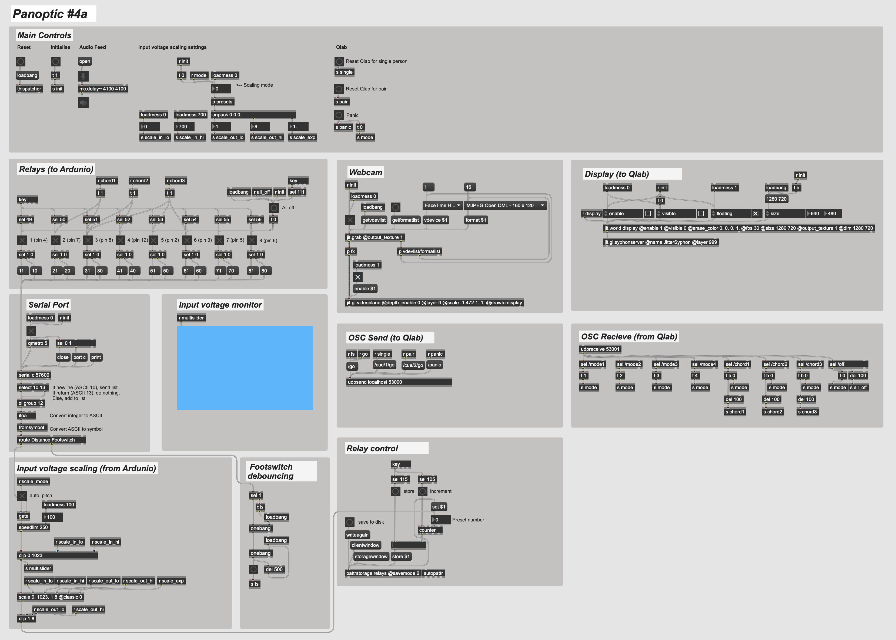

# Panoptic #4a

This is the software component of my interactive sound installation, *Panoptic #4a*. The piece was commissioned by [Kinetic Manchester](https://www.kineticmanchester.co.uk/) and exhibited at Paradise Works, 20-23rd February 2020.

**A video of the installation in action can be viewed [here](https://youtu.be/N3faFkEGIsc).**

Gallery note: *"Panoptic #4a is an interactive installation made from the innards of an electronic organ. Inside the room, you and a partner will be instructed in how to play a sensitive electronic instrument, by gently touching each other’s hands."*

## Patcher screenshot

