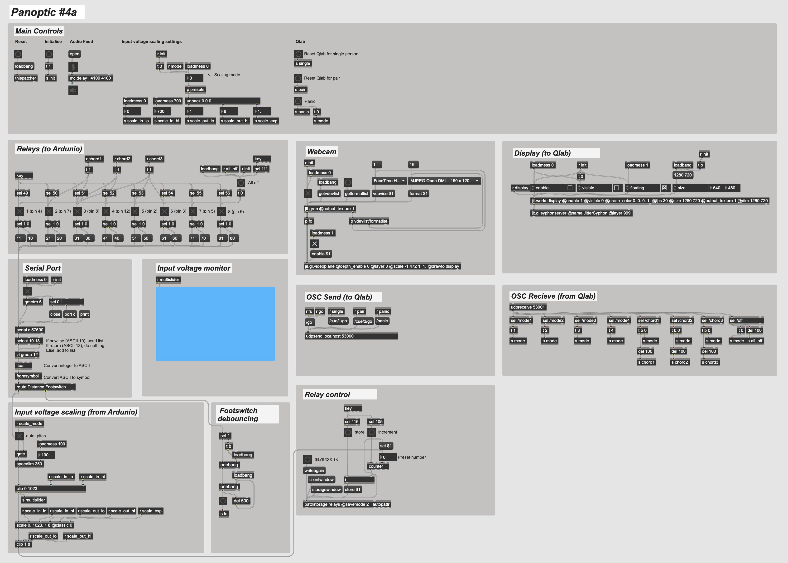
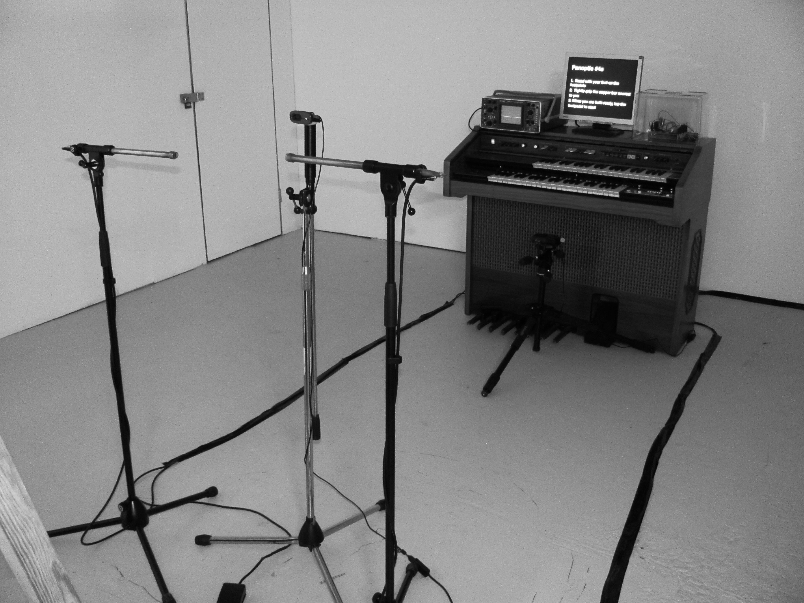
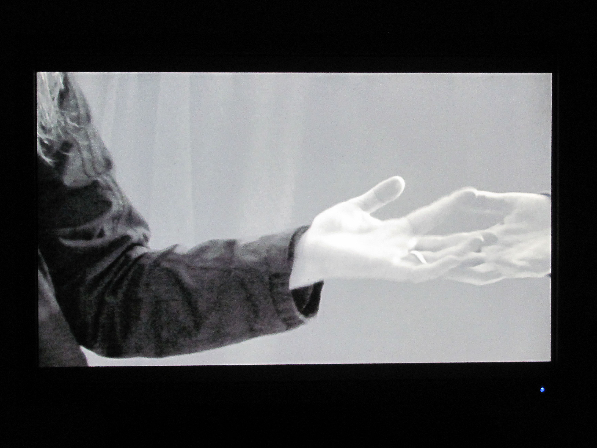
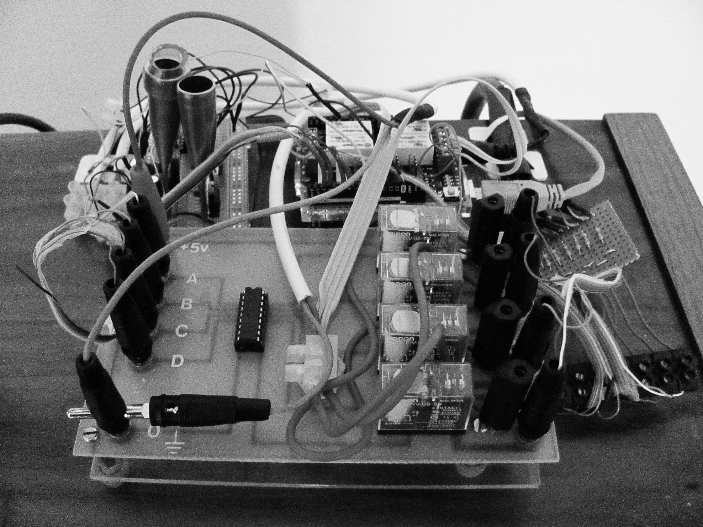

# Panoptic #4a

This is the software for my interactive sound installation, *Panoptic #4a*. The piece was commissioned by [Kinetic Manchester](https://www.kineticmanchester.co.uk/) and exhibited at Paradise Works, Salford, 20-23rd February 2020.
I made the software in this repository before I retrained as a developer.

**Videos of the installation in action:**
- [Video 1](https://youtu.be/N3faFkEGIsc)
- [Video 2](https://youtu.be/GHY9lf_Q5a0)

Gallery note: *"Panoptic #4a is an interactive installation made from the innards of an electronic organ. Inside the room, you and a partner will be instructed in how to play a sensitive electronic instrument, by gently touching each other’s hands."*

## Screenshot of `panoptic-4a.maxpat`

## Concept

The installation is designed to encourage participants to become more aware of physical touch, and of the relationship between touch and sound.

Two participants interact with the installation at a time. Each participant is invited to hold onto a copper bar, and then to join hands with the other person. When the hands of the participants touch, this completes a high-impedance circuit, causing an electronic organ to make distorted sounds. The intensity and tone of these sounds varies according to minute changes in pressure of the touch.

Following a series of on-screen prompts, participants are invited to explore different kinds of hand-to-hand touch, and to pay attention to the sounds that this makes. An oscilloscope provides a visualization of the sounds made, providing a level of accessability to participants who are deaf or hard of hearing.

## Technical notes

A set of eight relays driven by an Arduino allow different combinations of notes to be selected on the organ. The Arduino communicates with a (hidden) laptop via a serial connection, allowing the relays to be controlled by a patch created in Max/MSP.

Cues for the onscreen prompts and a video feed from a webcam are managed by Qlab, which runs on the same laptop, communicating with Max/MSP using the OSC protocol.

Towards the end of the piece, the pitches selected by the relays start to change dynamically according the pressure of the touch. This is achieved by taking the signal generated by the organ, converting it to a voltage using a rectifier circuit, and measuring it using the Arduino. This is sent to the Max/MSP patch, which selects which relays to turn on and off in response according to a scaling function. The result is that the organ can be 'played' by varying the pressure of touch. There's a demonstration of this [here](https://youtu.be/GHY9lf_Q5a0).

## Prerequisites
- To view or edit the Max patch (`panoptic-4a.maxpat`) – [Max 8](https://cycling74.com/downloads)
- To run `panoptic-4a.ino` – [Ardunio Uno Rev3](https://store.arduino.cc/arduino-uno-rev3) board and [Arduino Web Editor](create.arduino.cc)
- To view or edit cues stored in `panoptic-4a.qlab4` – [Qlab4](https://qlab.app/)

## Dependencies

- `jit.gl.syphonserver.mxo` is needed in order to share video between Max/MSP and Qlab. It can be downloaded [here](https://github.com/Syphon/Jitter/releases/tag/3).

## Author
**Stephen Bradshaw** – [Portfolio](https://www.stephenbradshaw.dev) | [Linkedin](https://www.linkedin.com/in/stephenbradshawdev/) | [Github](https://github.com/stephenjbradshaw)

## Acknowledgments

Many thanks to David Bradshaw, who designed the amplitude to voltage circuit and generously provided electronics help throughout.